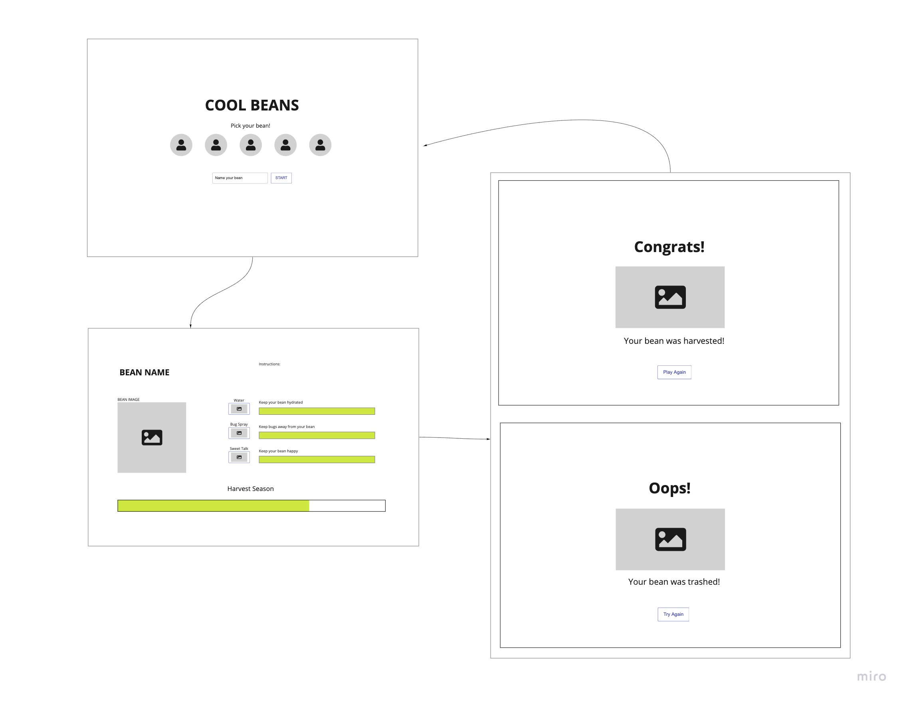

# Beanful
GA SEI Unit One Project: Create a game similar to "Tamagotchi" using HTML, CSS, JS, and Jquery

#### Objective 
User picks a bean of their choice to grow and keep alive until harvest season. They can water the bean, put bug spray to keep insects away, or sweet talk them to keep them happy. If one of these metrics hit zero, the bean will be trashed. If the metrics remain satisfied until harvest season, the bean will be harvested.  

#### Wireframe
https://miro.com/app/board/o9J_lhtgu_0=/?invite_link_id=70839324010

#### User Stories 

On the start screen: 

- As a user, I want to click the bean of my choice. 
- As a user, I want to type the name of my bean.
- As a user, I want to click “Play” to start playing.

On the play screen: 

- As a user, I want to click “water” to water my bean.
- As a user, I want to click “bug spray” to keep bugs away from my bean. 
- As a user, I want to click “sweet talk” to keep my bean happy. 
- As a user, I want to see the status of each bar changing at set intervals. 
- As a user, I want to be able to see the time status to the end of the bar (harvest). 

On the win screen: 

- As a user, I want to click “Play again” to go back to the start screen. 

On the lose screen: 

- As a user, I want to click “Try again” to go back to the start screen. 

Click here to play: [Link](https://skim121.github.io/Beanful/)
